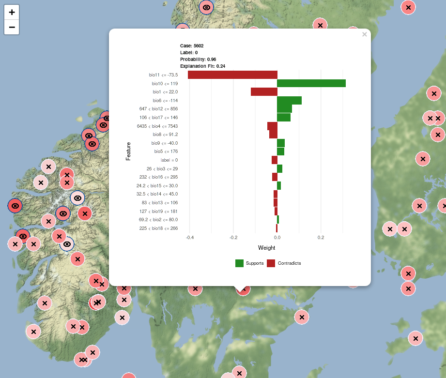

---
output:
  md_document:
    variant: markdown_github
    fig_width: 7
    fig_height: 7
---

<!-- README.md is generated from README.Rmd. Please edit that file -->

```{r echo=FALSE}
knitr::opts_chunk$set(
  collapse = TRUE,
  comment = "#>",
  fig.path = "README-"
)
```


```{r eval=FALSE, message=FALSE, warning=FALSE, include=FALSE}
library(mlr)
library(sdmexplain)
library(dplyr)
```

[](https://travis-ci.org/boyanangelov/sdmexplain)

# sdmexplain

`sdmexplain` is an R package to make Species Distribution Models more explainable.

## Installation

```
devtools::install_github("boyanangelov/sdmexplain")
```

## Example

Preparing training data.

```{r eval=FALSE}
occ_data_raw <- sdmbench::get_benchmarking_data("Lynx lynx")
occ_data <- occ_data_raw$df_data
occ_data$label <- as.factor(occ_data$label)

coordinates.df <- rbind(occ_data_raw$raster_data$coords_presence,
                        occ_data_raw$raster_data$background)
occ_data <- cbind(occ_data, coordinates.df)

train_test_split <- rsample::initial_split(occ_data, prop = 0.7)
data.train <- rsample::training(train_test_split)
data.test  <- rsample::testing(train_test_split)

train.coords <- dplyr::select(data.train, c("x", "y"))
data.train$x <- NULL
data.train$y <- NULL

test.coords <- dplyr::select(data.test, c("x", "y"))
data.test$x <- NULL
data.test$y <- NULL
```

Training SDM.

```{r eval=FALSE}
task <- makeClassifTask(id = "model", data = data.train, target = "label")
lrn <- makeLearner("classif.lda", predict.type = "prob")
mod <- train(lrn, task)
```

Preparing data for explainability.

```{r eval=FALSE}
explainable_data <- prepare_explainable_data(data.test, mod, test.coords)
```

```{r eval=FALSE}
processed_plots <- process_lime_plots(explainable_data$explanation)
```

Plotting explainable map.

```{r example, eval=FALSE}
plot_explainable_sdm(explainable_data$explanation_coordinates,
                     explainable_data$map_df,
                     processed_plots)
```


